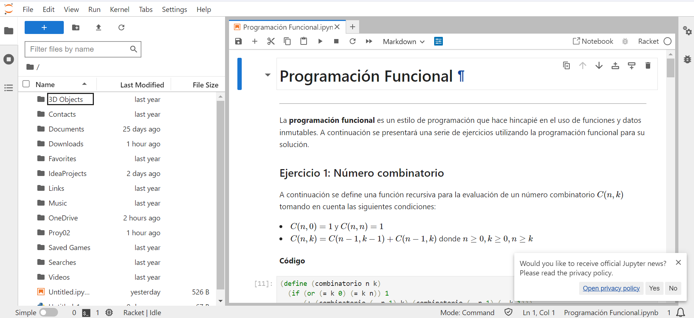
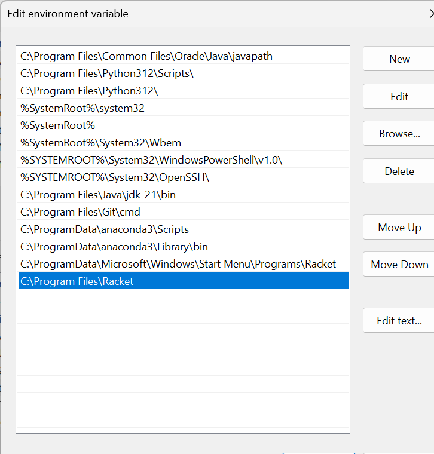
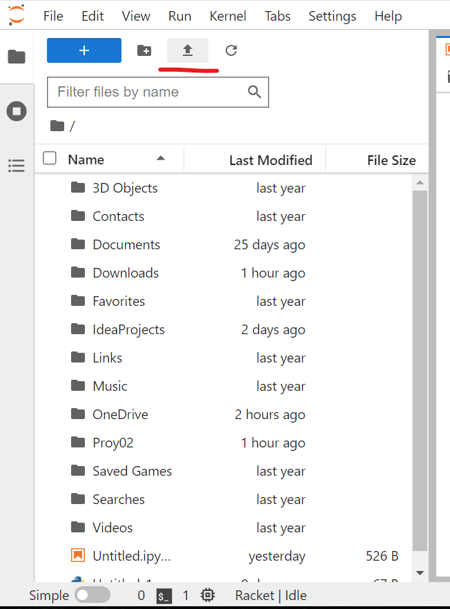
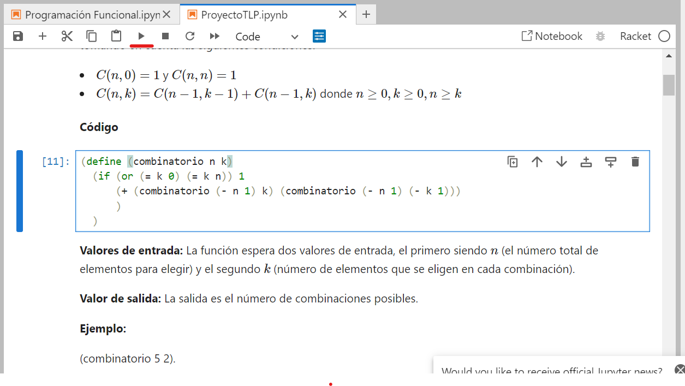
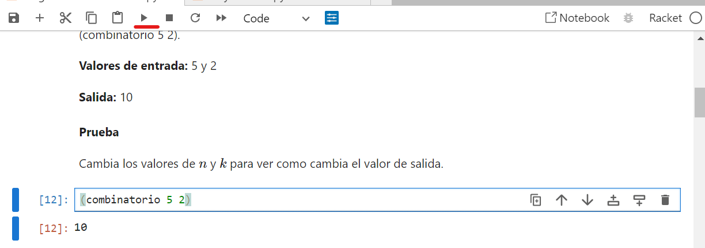

# Manual de Usuario 📓
Proyecto 02: Programación Funcional | TLP 

Equipo: 04 

**Integrantes:**
- Calderón Núñez Mariano Marcel | 19201125
- Ceballos Pérez Andrea | 19203419
- Kuh Esquivel Mauro Arif | 19200637

Para esta actividad, el equipo implementó la solución de 10 ejercios de programación funcional utilizando el lenguaje Racket y la herramienta de de Jupyter Notebook junto con el kernel iRacket. A continuación se presenta la información necesaria para la instalación y configuración del notebook al igual que las instrucciones para la ejecución de los ejercicios. 

## Instalación y Configuración
Para este proyecto es necesario contar con Jupyter Notebook y Racket, sigue los siguientes pasos en dado caso no tener estas herramientas instaladas. 

**Jupyter Notebook**

1. Instalar Python

Jupyter Notebook se ejecuta en Python, así que necesitarás tener Python instalado en tu sistema. Puedes descargar la última versión de Python desde el sitio web oficial (https://www.python.org/). Asegúrate de marcar la opción "Add Python to PATH" durante la instalación para que Python pueda ser accesible desde la línea de comandos.

2. Instalar Jupyter Notebook

Una vez que tengas Python, puedes instalar Jupyter Notebook ejecutando el siguiente comando en tu terminal o línea de comandos(este comando instalará Jupyter Notebook junto con JupyterLab):

```
pip install jupyterlab
```

3. Abrir Jupyter Notebook

Una vez instalado, inicia jupyter notebook con el siguiente comando: 

```
jupyter lab
```
Después te llevará a jupyter lab, donde podrás crear una nueva carpeta o notebook haciendo clic en el botón azul "new". 



**Racket**

Ahora sigue los siguientes pasos para instalar Racket. 

1. Instalar Racket
   
Visita el sitio web oficial de Racket en https://racket-lang.org/ y haz clic en el botón de descarga correspondiente a tu sistema operativo (Windows, macOS o Linux). Alternativamente, también puedes instalar Racket utilizando un gestor de paquetes en sistemas basados en Linux.

2. Agregar Path

Una vez instalado, agrega el path del directorio ejecutable para que pueda ser accedido desde la línea de comandos. 



3. Instalar iRacket Kernel

Una vez agregado el path tanto de Python como el de Racket, instala el iRacket Kernel con el siguiente comando: 

```
raco iracket install
```

**Abirir el Notebook** 

Una vez realizados los pasos anteriores sigue los siguientes pasos para abrir el notebook de Programación funcional: 

1. Descargar el notebook [Programacion Funcional](ProgramaciónFuncional.ipynb)
2. Abrir Jupyter Lab desde la terminal, con el comando proporcionado en la sección anterior.
3. Haz clic en el botón "upload" y selecciona el el archivo descargado en el paso 1.

   

4. Explorar el notebook. 


## Ejecucuión de los Ejercicios 
Una vez abierto el notebook, dentro de él encontrarás un total de 10 ejercicios, cada uno con su descripción, código, valores de entrada y salida esperados y una sección donde se podrá modificar los valores de entrada para probar la función. Para ejecutar cada uno de los ejercicios sigue los siguientes pasos: 

1. Seleccionar la sección con el código correspondiente.
2. Hacer clic en el botón correr (señalado con rojo en la siguiente imagen). 
   
   

3. Seleccionar la sección donde se llama a la función y si desea, modifica los valores de entrada.
4. Hacer clic en el botón correr.
5. Observar el valor de salida (en la imagen es 10).

   


## Conclusión 

Gracias al proyecto que se llevó a cabo el equipo logró desarrollar nuevas habilidades en cuanto al uso del Racket, la programación funcional y la recursivad. Del mismo modo, se logró entender la importancia que tiene la programación funcional como paradigma de programación. 
